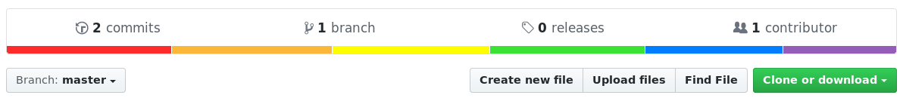

<!-- PROJECT LOGO -->

 

  

<h3 align="center">ZokouMD-Plugins</h3>

  

    External and additional commands for ZokouMd bot by @CrazyPrince for you guyzzz !
     
    <a href="https://github.com/CrazyPrince/ZokouMD-Plugins"><strong>Explore the docs »</strong></a>
     
     
    <a href="https://github.com/CrazyPrince/ZokouMD-Plugins">View Demo</a>
    ·
    <a href="https://github.com/CrazyPrince/ZokouMD-Plugins/issues/new?labels=bug&template=bug-report---.md">Report Bug</a>
    ·
    <a href="https://github.com/CrazyPrince/ZokouMD-Plugins/issues/new?labels=enhancement&template=feature-request---.md">Request Feature</a>
  

#Contenu du readme

(<a href="#readme-top">back to top</a>)

(<a href="#readme-top">back to top</a>)

(<a href="#readme-top">back to top</a>)

(<a href="#readme-top">back to top</a>)

